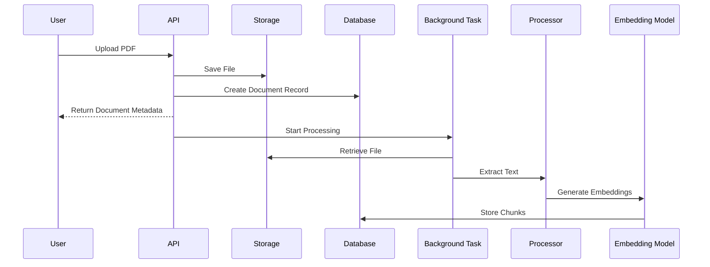

# AI Knowledge Assistant API Design

## 1. Overview

The AI Knowledge Assistant API provides endpoints for uploading documents, managing stored files, and querying uploaded content through a Retrieval-Augmented Generation (RAG) pipeline.

The API is built using FastAPI and follows REST principles.

The main responsibilities of the API layer are:

- Accept document uploads
- Manage document metadata
- Retrieve stored documents
- Remove documents and associated files
- Process natural language questions
- Return grounded AI-generated answers with sources

---

# 2. API Architecture

The API follows a layered architecture:

```text
Client
  |
  v
FastAPI Router Layer
  |
  v
Service Layer
  |
  +----------------+
  |                |
Storage        Database
Layer          Layer
  |
  v
External Services
(LLM + Embeddings)
```

The API layer is responsible only for:

- Request validation
- Authentication/dependency handling (future)
- Calling application services
- Returning structured responses

Business logic is handled by dedicated service modules.

---

# 3. Base URL

Local development:

```
http://localhost:8000
```

API documentation:

```
Swagger UI:
http://localhost:8000/docs
```

OpenAPI specification:

```
http://localhost:8000/openapi.json
```

---

# 4. Document Management API

## 4.1 Upload Document

### Endpoint

```
POST /documents/upload
```

### Description

Uploads a PDF document to the configured storage provider and starts asynchronous document processing.

The upload request immediately returns after storing the file. Document extraction, chunking, and embedding generation happen in the background.

---

### Request

Content-Type:

```
multipart/form-data
```

Form field:

| Field | Type | Required | Description |
|---|---|---|---|
| file | PDF file | Yes | Document to upload |

---

### Processing Flow



---

### Successful Response

Status:

```
201 Created
```

Example:

```json
{
  "id": 1,
  "filename": "employee_handbook.pdf",
  "file_type": "application/pdf",
  "file_size": 245632,
  "processing_status": "UPLOADED",
  "created_at": "2026-07-24T10:30:00"
}
```

---

### Processing States

Documents move through the following lifecycle:

```text
UPLOADED
    |
    v
PROCESSING
    |
    v
COMPLETED
```

If processing fails:

```text
PROCESSING
    |
    v
FAILED
```

---

### Error Responses

#### Invalid Request

Status:

```
400 Bad Request
```

Example:

```json
{
  "detail": "Invalid document."
}
```

---

#### Server Error

Status:

```
500 Internal Server Error
```

Example:

```json
{
  "detail": "Unexpected server error."
}
```

---

# 5. Retrieve Documents

## 5.1 List Uploaded Documents

### Endpoint

```
GET /documents
```

### Description

Returns all uploaded documents ordered by creation date.

This endpoint provides document metadata and current processing status.

---

### Successful Response

Status:

```
200 OK
```

Example:

```json
[
  {
    "id": 1,
    "filename": "employee_handbook.pdf",
    "file_type": "application/pdf",
    "file_size": 245632,
    "processing_status": "COMPLETED",
    "created_at": "2026-07-24T10:30:00"
  }
]
```

---

# 5.2 Retrieve Document Details

### Endpoint

```
GET /documents/{document_id}
```

### Description

Returns metadata and processing information for a specific document.

---

### Path Parameter

| Parameter | Type | Description |
|---|---|---|
| document_id | integer | Unique document identifier |

---

### Successful Response

Status:

```
200 OK
```

Example:

```json
{
  "id": 1,
  "filename": "employee_handbook.pdf",
  "file_type": "application/pdf",
  "file_size": 245632,
  "processing_status": "COMPLETED",
  "created_at": "2026-07-24T10:30:00"
}
```

---

### Error Response

If the document does not exist:

Status:

```
404 Not Found
```

Example:

```json
{
  "detail": "Document not found."
}
```

---

# 6. File Retrieval API

## 6.1 Download Original Document

### Endpoint

```
GET /documents/{document_id}/file
```

### Description

Retrieves the original uploaded document from the configured storage provider.

The API supports different storage implementations through the storage abstraction layer.

Current providers:

- Local file storage
- Google Cloud Storage

---

### Successful Response

Status:

```
200 OK
```

Response:

```
Binary PDF file
```

Headers:

```http
Content-Disposition: attachment; filename="document.pdf"
Content-Type: application/pdf
```

---

### Error Responses

Document not found:

```
404 Not Found
```

```json
{
  "detail": "Document not found."
}
```

Stored file unavailable:

```
404 Not Found
```

```json
{
  "detail": "File not found."
}
```

---

# 7. Delete Document API

## 7.1 Delete Document

### Endpoint

```
DELETE /documents/{document_id}
```

### Description

Deletes:

- Document database record
- Associated stored file

The endpoint removes both metadata and physical storage.

---

### Successful Response

Status:

```
200 OK
```

Example:

```json
{
  "message": "Document deleted successfully."
}
```

---

### Error Response

If the document does not exist:

Status:

```
404 Not Found
```

Example:

```json
{
  "detail": "Document not found."
}
```

---

# 8. Retrieval-Augmented Generation (RAG) API

## 8.1 Search Documents

### Endpoint

```
POST /documents/search
```

### Description

Answers user questions using information retrieved from uploaded documents.

The endpoint performs:

1. Convert question into an embedding vector.
2. Search document chunks using vector similarity.
3. Filter weak matches using similarity thresholds.
4. Send relevant context to the LLM.
5. Return an answer with source references.

---

## Request Body

Content-Type:

```
application/json
```

Schema:

```json
{
  "question": "What operating system is recommended?"
}
```

---

## Successful Response

Status:

```
200 OK
```

Example:

```json
{
  "answer": "The recommended operating system is Ubuntu Linux.",
  "sources": [
    {
      "document": "technical_manual.pdf",
      "page": 4,
      "relevance": 92,
      "preview": "The application is supported on Ubuntu Linux..."
    }
  ]
}
```

---

# 9. RAG Response Design

The response contains:

## Answer

The generated response from the LLM.

The generation process follows grounding rules:

- Only use retrieved document information.
- Avoid unsupported assumptions.
- Clearly state when information is unavailable.

---

## Sources

Source metadata provides transparency about where the answer originated.

Each source contains:

| Field | Description |
|---|---|
| document | Original document name |
| page | Page number containing information |
| relevance | Similarity relevance score |
| preview | Extracted text preview |

---

# 10. API Error Handling

The API follows consistent HTTP error responses.

## Common Status Codes

| Status Code | Meaning |
|---|---|
| 200 | Successful request |
| 201 | Resource created |
| 400 | Invalid request |
| 404 | Resource not found |
| 500 | Unexpected server error |

---

## Error Response Format

Example:

```json
{
  "detail": "Document not found."
}
```

---

# 11. Future API Improvements

Potential future improvements:

- Authentication and authorization
- User-specific document access
- Pagination for document listing
- Upload validation and file size limits
- API versioning
- Rate limiting
- Streaming LLM responses
- Additional document formats
- Background task queue integration