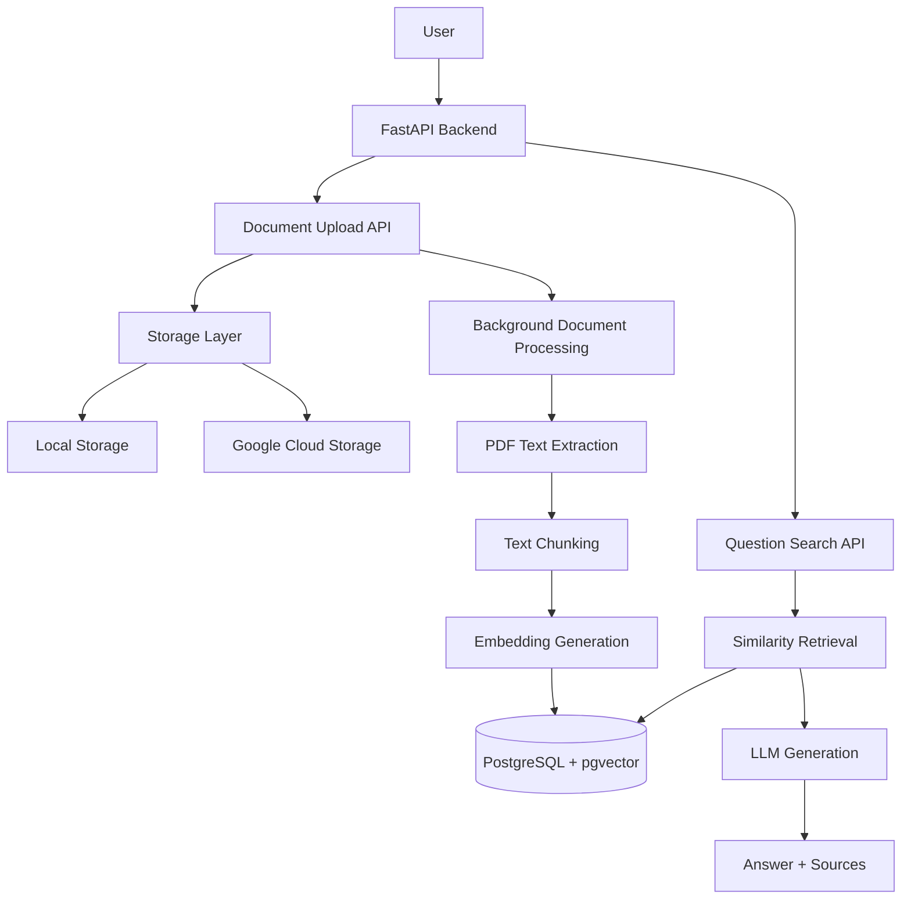
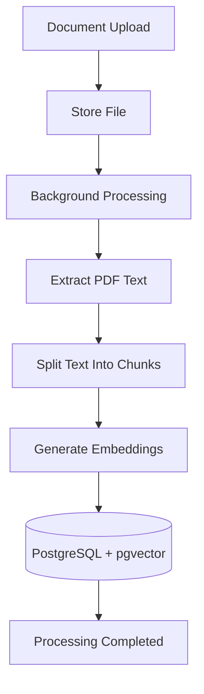
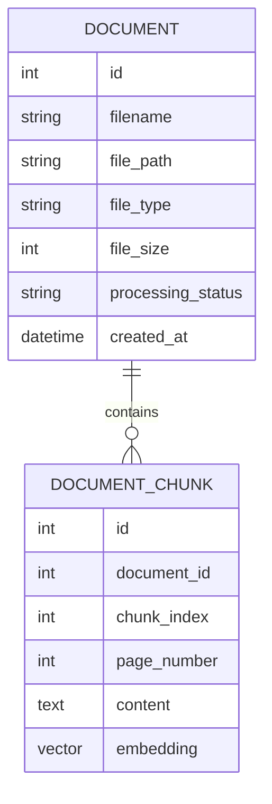
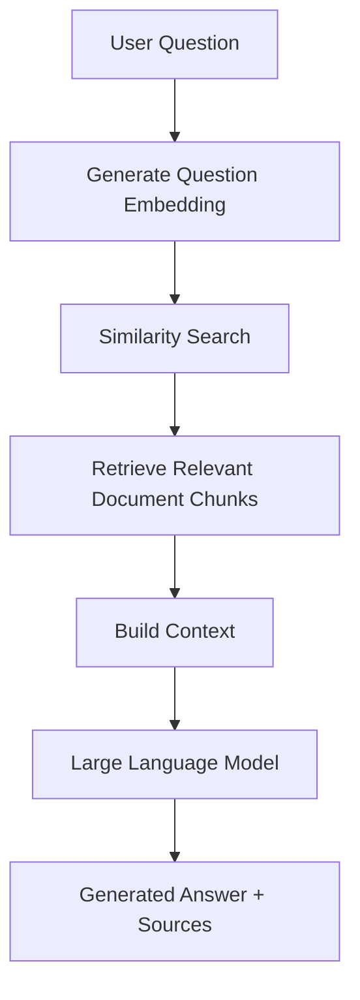

# AI Knowledge Assistant Architecture

## 1. Overview

The AI Knowledge Assistant is a Retrieval-Augmented Generation (RAG) application that enables users to upload documents and ask questions using natural language.

The system processes uploaded documents, extracts text, creates vector embeddings, stores document information, retrieves relevant content, and generates grounded answers using a Large Language Model (LLM).

The application is designed with a modular backend architecture that separates API handling, business logic, storage management, document processing, retrieval, and AI generation components.

The architecture supports:

- Document upload and management
- Asynchronous document processing
- Semantic search using vector embeddings
- Context-aware answer generation
- Multiple storage providers
- Future production scaling

---

# 2. High-Level Architecture



---

# 3. System Components

## 3.1 FastAPI Backend

The FastAPI application provides the main interface between users and the AI Knowledge Assistant system.

### Responsibilities

- Handle API requests
- Validate incoming data
- Manage document operations
- Trigger background processing
- Coordinate retrieval and answer generation
- Return structured responses

The backend follows a layered architecture:

```text
API Layer
    |
Service Layer
    |
Data Access Layer
    |
Database / External Services
```

---

# 4. API Layer

The API layer contains the application routes responsible for handling client requests.

### Current Document Endpoints

| Method | Endpoint | Description |
|--------|----------|-------------|
| POST | `/documents/upload` | Upload a PDF document |
| GET | `/documents` | Retrieve all uploaded documents |
| GET | `/documents/{document_id}` | Retrieve document metadata |
| GET | `/documents/{document_id}/file` | Download original document |
| DELETE | `/documents/{document_id}` | Delete document and stored file |
| POST | `/documents/search` | Ask questions over uploaded documents |

The API layer does not contain business logic. Instead, it delegates processing to dedicated services.

---

# 5. Storage Architecture

The application uses a storage abstraction layer to separate file management from business logic.

The storage interface defines common operations:

- Upload file
- Retrieve file
- Delete file
- Check storage availability

This allows different storage providers to be used without modifying the document processing workflow.

### Current Implementations

```text
BaseStorage
     |
     +----------------+
     |                |
LocalStorage     GCSStorage
```

---

## 5.1 Local Storage

Local storage is used during development.

### Responsibilities

- Store uploaded documents locally
- Retrieve document bytes
- Delete stored files
- Verify storage availability

### Example Use Case

```text
Developer Environment
        |
        v
Local File System
        |
        v
uploads/documents/
```

---

## 5.2 Google Cloud Storage

Google Cloud Storage is supported as a cloud storage option for future production deployment.

### Responsibilities

- Store uploaded documents in cloud buckets
- Retrieve files when required
- Delete documents
- Validate bucket connectivity

The storage abstraction allows migration from local storage to cloud storage without changing the application logic.

```text
Application
     |
     v
Storage Interface
     |
     +------------+
     |            |
 Local        Google Cloud
Storage       Storage
```
---

# 6. Document Processing Pipeline

Document processing is executed asynchronously after a document upload.

This prevents long-running operations such as PDF extraction and embedding generation from blocking the upload request.

## Processing Workflow



The document processing service performs the following steps:

- Retrieve the uploaded document from storage
- Create a temporary PDF file for processing
- Extract text from PDF pages
- Split extracted text into smaller chunks
- Generate embeddings for each chunk
- Store document chunks and embeddings in PostgreSQL
- Update document processing status

### Processing States

```text
UPLOADED
    |
    v
PROCESSING
    |
    v
COMPLETED
```

If processing fails:

```text
PROCESSING
    |
    v
FAILED
```

---

# 7. Database Architecture

The application uses PostgreSQL as the primary database with pgvector support for storing and searching document embeddings.

## Database Relationship




## Main Database Entities

### 7.1 Document Table

The **Document** table stores uploaded document metadata.

Stored information includes:

- Original filename
- Storage location
- File type
- File size
- Processing status
- Creation timestamp
- Processing timestamps
- Error information when processing fails

### Example Lifecycle

```text
Document uploaded
        |
        v
Status: UPLOADED
        |
        v
Background processing starts
        |
        v
Status: PROCESSING
        |
        v
Status: COMPLETED / FAILED
```

---

### 7.2 Document Chunk Table

The **DocumentChunk** table stores processed sections of documents.

Each chunk contains:

- Extracted text content
- Page number
- Chunk position
- Vector embedding

Embeddings allow semantic similarity search instead of traditional keyword matching.

---

# 8. Retrieval-Augmented Generation (RAG) Architecture

The question-answering workflow combines vector search with LLM generation.

## RAG Workflow




## 8.1 Retrieval Process

When a user asks a question:

1. The question is converted into an embedding vector.
2. The system searches stored document embeddings.
3. The most similar chunks are retrieved.
4. Weak matches are removed using similarity thresholds.
5. Relevant context is passed to the LLM.

The retrieval system uses cosine distance:

- Lower distance = more similar
- Higher distance = less similar

---

## 8.2 Answer Generation

The LLM receives:

- User question
- Retrieved document context

The generation process follows strict grounding rules:

- Use only information from retrieved documents.
- Avoid hallucinating missing information.
- Clearly state when information is unavailable.
- Return source references when available.

---

# 9. Technology Stack

## Backend

- Python
- FastAPI
- SQLAlchemy
- Pydantic Settings
- Uvicorn

## Database

- PostgreSQL
- pgvector extension for vector storage and similarity search

## AI Components

- Sentence Transformers (`all-MiniLM-L6-v2`) for document embeddings
- Groq LLM API for answer generation

## Infrastructure

- Docker
- Docker Compose

## Testing

- Pytest
- FastAPI TestClient

---

# 10. Design Principles

## Separation of Responsibilities

The application separates concerns into dedicated layers:

- Routers handle HTTP requests.
- Services contain business logic.
- Storage manages file persistence.
- Database models represent stored data.
- AI services handle embeddings and generation.

This improves maintainability and testing.

---

## Storage Abstraction

Storage providers are isolated behind a common interface.

### Benefits

- Easy migration between storage providers.
- Reduced coupling.
- Easier testing with fake storage implementations.

---

## Asynchronous Processing

Document processing runs in the background after upload.

### Benefits

- Faster API responses.
- Better user experience.
- Support for larger documents in future versions.

---

## Grounded AI Responses

The system prioritizes accuracy by restricting responses to retrieved document information.

This reduces hallucination risk and improves reliability.

---

# 11. Future Improvements

Potential future enhancements:

- Authentication and authorization
- User-specific document permissions
- Background task queue using Celery or similar tools
- Improved document processing for additional formats
- Automated RAG evaluation metrics
- Monitoring and logging dashboards
- Cloud deployment with container orchestration
- Advanced vector database options

---
