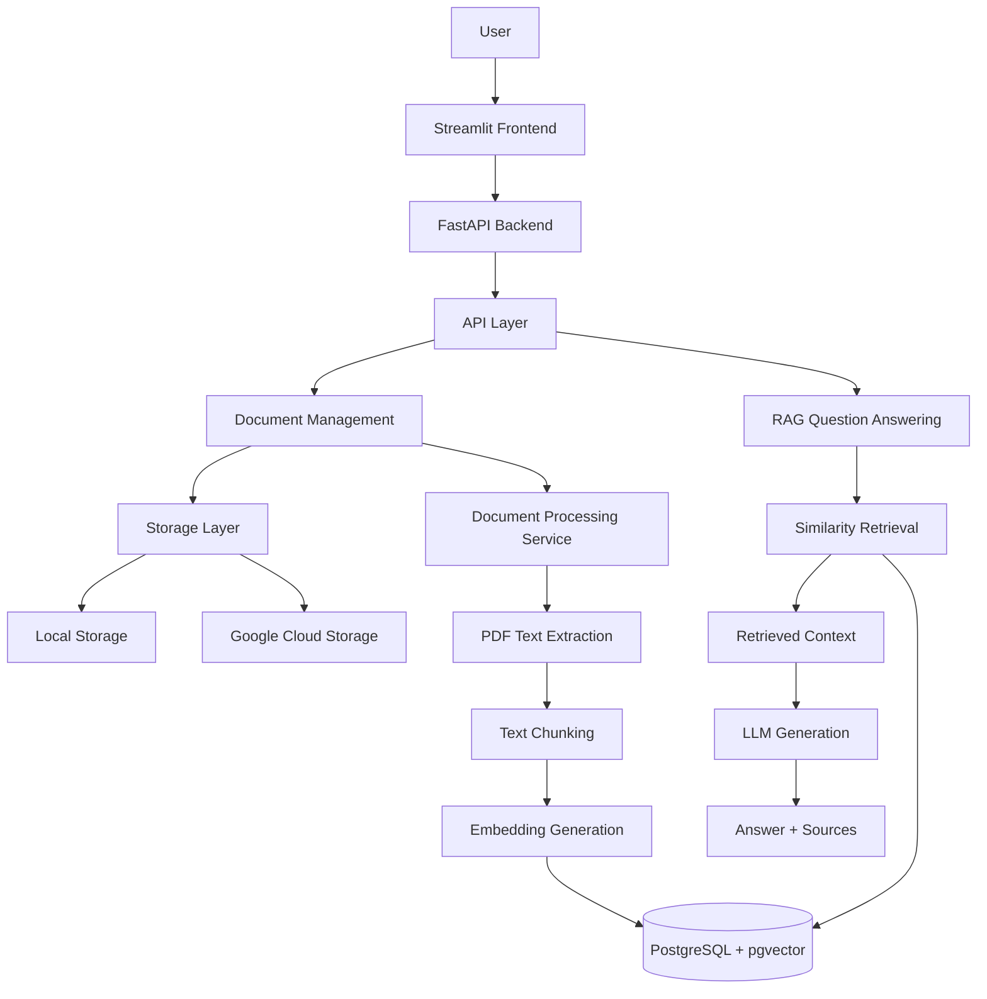
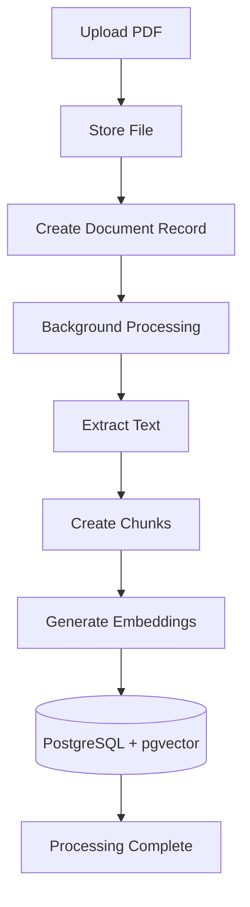
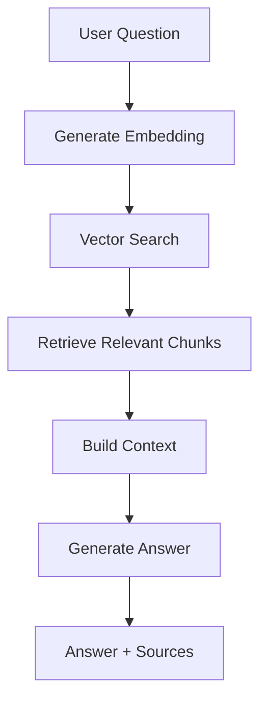

# AI Knowledge Assistant Architecture

## 1. Overview

The AI Knowledge Assistant is a Retrieval-Augmented Generation (RAG) application that enables users to upload documents and ask natural language questions.

The system processes uploaded documents, extracts relevant information, generates vector embeddings, performs semantic retrieval, and produces grounded answers using a Large Language Model (LLM).

The architecture is designed around:

- Modular backend services
- Separation of responsibilities
- Storage abstraction
- Asynchronous document processing
- Vector-based semantic retrieval
- Future cloud scalability

The system currently supports:

- PDF document ingestion
- Background processing
- Semantic search
- AI-generated answers with source references
- Local and cloud storage abstraction
- Streamlit-based user interface

---

# 2. High-Level Architecture



---

# 3. Application Components

The system is divided into several layers:

```text
                 Streamlit Frontend

                         |

                         |

                  FastAPI Backend

                         |

        +----------------+----------------+

        |                                 |

   API Layer                       Service Layer

                                         |

                              +----------+----------+

                              |                     |

                       Storage Layer          Database Layer

                              |

                         External AI Services
```

Each layer has a specific responsibility.

---

# 4. Frontend Layer

## Technology

- Streamlit

## Responsibilities

The frontend provides:

- Document upload interface
- Document library
- Processing status display
- Question-answer interface
- Source evidence display

The frontend communicates with the backend through HTTP requests.

Architecture:

```text
Streamlit UI

      |

HTTP Requests

      |

FastAPI API
```

The frontend does not contain business logic.

Its responsibility is:

- Collect user input
- Display application state
- Present AI responses

---

# 5. Backend API Layer

## Technology

- FastAPI

The API layer acts as the entry point into the system.

## Responsibilities

The API layer handles:

- HTTP request processing
- Input validation
- Response formatting
- Endpoint routing
- Dependency management

Available endpoints:

| Method | Endpoint | Purpose |
|---|---|---|
| POST | `/documents/upload` | Upload documents |
| GET | `/documents` | Retrieve documents |
| GET | `/documents/{id}` | Retrieve document metadata |
| GET | `/documents/{id}/file` | Download original file |
| DELETE | `/documents/{id}` | Delete document |
| POST | `/documents/search` | Ask questions using RAG |

The API layer does not contain processing logic.

Business operations are delegated to services.

---

# 6. Service Layer

The service layer contains the main application logic.

Current services include:

---

## 6.1 Document Processing Service

Responsible for transforming uploaded files into searchable knowledge.

Workflow:

```text
PDF File

 |

Text Extraction

 |

Chunk Creation

 |

Embedding Generation

 |

Vector Storage
```

Responsibilities:

- Retrieve uploaded files
- Extract PDF content
- Split documents into chunks
- Generate embeddings
- Store document chunks
- Update processing status

---

## 6.2 Retrieval Service

Responsible for finding relevant information.

Workflow:

```text
User Question

 |

Question Embedding

 |

Vector Similarity Search

 |

Relevant Chunks
```

Responsibilities:

- Generate query embeddings
- Search document vectors
- Rank relevant chunks
- Apply similarity filtering

---

## 6.3 RAG Service

Responsible for generating grounded answers.

Workflow:

```text
Retrieved Context

+

User Question

        |

        v

LLM Prompt

        |

        v

Generated Answer
```

Responsibilities:

- Construct prompts
- Send context to LLM
- Generate responses
- Attach source references

---

# 7. Storage Architecture

The application uses a storage abstraction layer.

The purpose is to separate file management from application logic.

Architecture:

```text
              BaseStorage

                   |

        +----------+----------+

        |                     |

 LocalStorage            GCSStorage
```

---

## 7.1 Local Storage

Used during:

- Local development
- Portfolio demonstration

Responsibilities:

- Save uploaded files
- Retrieve files
- Delete files

Example:

```text
uploads/

   documents/

        example.pdf
```

---

## 7.2 Google Cloud Storage

Supported as a production storage provider.

Benefits:

- Persistent storage
- Scalable capacity
- Cloud deployment compatibility

The application can switch storage providers without changing business logic.

---

# 8. Document Processing Pipeline

Document processing occurs asynchronously after upload.

The upload request returns immediately while processing continues in the background.

Workflow:



---

## Processing States

Documents follow this lifecycle:

```text
UPLOADED

    |

    v

PROCESSING

    |

    v

COMPLETED
```

Failed processing:

```text
PROCESSING

    |

    v

FAILED
```

---

# 9. Database Architecture

The application uses:

- PostgreSQL
- pgvector extension

The database stores:

- Document metadata
- Processing states
- Extracted chunks
- Embeddings

Relationship:

```text
Document

    |

    +---- DocumentChunk

    +---- DocumentChunk

    +---- DocumentChunk
```

A single document can contain multiple searchable chunks.

---

# 10. Retrieval-Augmented Generation Architecture

The RAG pipeline combines semantic retrieval with LLM generation.

Workflow:



---

# 11. Design Principles

## Separation of Responsibilities

Each component has a clear role:

| Component | Responsibility |
|---|---|
| Router | HTTP communication |
| Service | Business logic |
| Storage | File persistence |
| Database | Structured data storage |
| AI Services | Embeddings and generation |

---

## Storage Abstraction

The system avoids coupling application logic to one storage provider.

Benefits:

- Easier migration
- Improved testing
- Cleaner architecture

---

## Grounded AI Responses

The system prioritizes reliable answers.

The LLM receives only retrieved document context.

This reduces:

- Hallucination risk
- Unsupported responses
- Incorrect information generation

---

## Asynchronous Processing

Long-running tasks are separated from API requests.

Benefits:

- Faster uploads
- Better user experience
- Future scalability

---

# 12. Current Deployment Architecture

Current portfolio deployment:

```text
                    User

                     |

                     |

              Streamlit Cloud

                     |

                     |

               FastAPI Backend

                     |

          +----------+----------+

          |                     |

      Render API          PostgreSQL

                             

                     |

              Document Storage
```

---

# 13. Future Scalability Improvements

Future production improvements include:

## Background Workers

Replace FastAPI background tasks with:

- Celery
- Redis Queue
- Cloud Tasks

---

## Authentication

Introduce:

- User accounts
- Document ownership
- Permissions
- Multi-user isolation

---

## Cloud Storage

Move from local storage to:

- Google Cloud Storage
- Amazon S3
- Azure Blob Storage

---

## Monitoring

Add:

- Application metrics
- Error tracking
- AI evaluation metrics
- Logging dashboards

---

# 14. Summary

The AI Knowledge Assistant architecture combines:

```text
FastAPI
+
Streamlit
+
PostgreSQL + pgvector
+
Sentence Transformers
+
LLM Generation
```

to create a modular RAG-based document intelligence system.

The architecture prioritizes:

- Maintainability
- Reliability
- Explainability
- Cloud readiness
- Future scalability