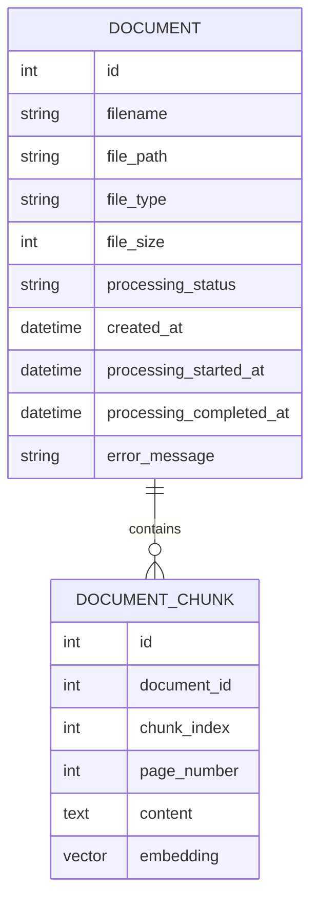

# AI Knowledge Assistant Database Design

## 1. Overview

The AI Knowledge Assistant uses PostgreSQL as the primary database.

The database supports the Retrieval-Augmented Generation (RAG) workflow by storing:

- Document metadata
- Processing states
- Extracted document chunks
- Vector embeddings for semantic search

The database combines traditional relational storage with vector similarity search through the **pgvector** extension.

---

# 2. Database Technology

## Database

```
PostgreSQL
```

## Vector Extension

```
pgvector
```

## ORM

```
SQLAlchemy
```

## Migration Tool

```
Alembic
```

The application uses SQLAlchemy models to define database structures and Alembic to manage schema changes.

---

# 3. Database Architecture

The database is responsible for two main functions:

```text
Relational Data Storage

        +

Vector Similarity Search
```

Architecture:

```text
Application

     |

SQLAlchemy ORM

     |

PostgreSQL

     |

+----------------+

|                |

Tables        pgvector

                |

          Embeddings
```

---

# 4. Entity Relationship Model



Relationship:

```text
Document

    |

    +---- DocumentChunk

    +---- DocumentChunk

    +---- DocumentChunk
```

A single document can contain many searchable chunks.

---

# 5. Document Table

## Purpose

The `documents` table stores information about uploaded files.

It tracks:

- Original file details
- Storage location
- Processing lifecycle
- Processing errors

---

## Schema

| Column | Type | Description |
|---|---|---|
| id | Integer | Primary key |
| filename | String | Original uploaded filename |
| file_path | String | Storage location |
| file_type | String | MIME type |
| file_size | Integer | File size in bytes |
| processing_status | String | Current processing state |
| created_at | DateTime | Upload timestamp |
| processing_started_at | DateTime | Processing start time |
| processing_completed_at | DateTime | Completion time |
| error_message | Text | Processing failure details |

---

# 6. Document Lifecycle

Documents move through processing states.

Successful workflow:

```text
UPLOAD

   |

   v

UPLOADED

   |

   v

PROCESSING

   |

   v

COMPLETED
```

Failure workflow:

```text
PROCESSING

   |

   v

FAILED
```

The status field allows the frontend to display processing progress.

---

# 7. Document Chunk Table

## Purpose

The `document_chunks` table stores processed sections of uploaded documents.

During processing:

```text
PDF

 |

Text Extraction

 |

Chunking

 |

Embedding Generation

 |

Database Storage
```

---

## Schema

| Column | Type | Description |
|---|---|---|
| id | Integer | Primary key |
| document_id | Integer | Related document |
| chunk_index | Integer | Position inside document |
| page_number | Integer | Original PDF page |
| content | Text | Extracted text |
| embedding | Vector | Semantic representation |

---

# 8. Vector Embedding Storage

The system uses embeddings to enable semantic search.

Process:

```text
Document Chunk

        |

        v

Embedding Model

        |

        v

Vector Representation

        |

        v

pgvector Storage
```

Example:

```text
Text:

"The application supports Linux"


Embedding:

[
0.023,
-0.114,
0.532,
...
]
```

The vector representation allows the system to compare meaning rather than exact words.

---

# 9. Similarity Search

When a user asks a question:

```text
User Question

       |

       v

Question Embedding

       |

       v

Compare Against Stored Vectors

       |

       v

Retrieve Similar Chunks
```

The system uses cosine similarity/distance.

Concept:

```text
Closer vector distance

        |

        v

More semantically similar
```

---

# 10. Database Access Layer

Database operations are separated from API routes.

Architecture:

```text
API Router

     |

Service Layer

     |

Database Access Layer

     |

SQLAlchemy Models

     |

PostgreSQL
```

Responsibilities:

- Create database sessions
- Query documents
- Retrieve chunks
- Persist processing results
- Manage transactions

---

# 11. Database Migrations

Database changes are managed using Alembic.

Migration workflow:

```text
Modify SQLAlchemy Model

        |

        v

Generate Migration

        |

        v

Apply Migration

        |

        v

Database Updated
```

Commands:

Create migration:

```bash
alembic revision --autogenerate -m "description"
```

Apply migration:

```bash
alembic upgrade head
```

Check migration state:

```bash
alembic current
```

---

# 12. Design Decisions

## Separate Metadata and Content

Document metadata and chunks are stored separately.

Benefits:

- Cleaner data model
- Faster document management
- Efficient retrieval

---

## Use PostgreSQL + pgvector

The system avoids introducing a separate vector database during early development.

Benefits:

- Single database system
- Lower operational complexity
- Easier local development

---

## Store Page Numbers

Each chunk stores its original PDF page number.

Benefits:

- Source references
- Better user trust
- Easier document verification

---

# 13. Current Limitations

The current database design does not yet include:

- Users
- Authentication
- Document ownership
- Permission management
- Multi-tenant separation

These will be introduced in a future version.

---

# 14. Future Improvements

Potential improvements:

## User Management

Add:

- Users table
- Authentication records
- Document ownership relationships

Example:

```text
User

 |

 +---- Documents
```

---

## Access Control

Add:

- Roles
- Permissions
- Shared documents

---

## Scaling Improvements

For larger workloads:

- Advanced indexing
- Read replicas
- Dedicated vector databases

Possible alternatives:

- Pinecone
- Weaviate
- Milvus

---

# Summary

The database architecture provides:

- Reliable document storage
- Vector-based semantic retrieval
- Clear document lifecycle tracking
- Foundation for future multi-user expansion

The design balances simplicity for the current portfolio deployment while maintaining a path toward production scalability.