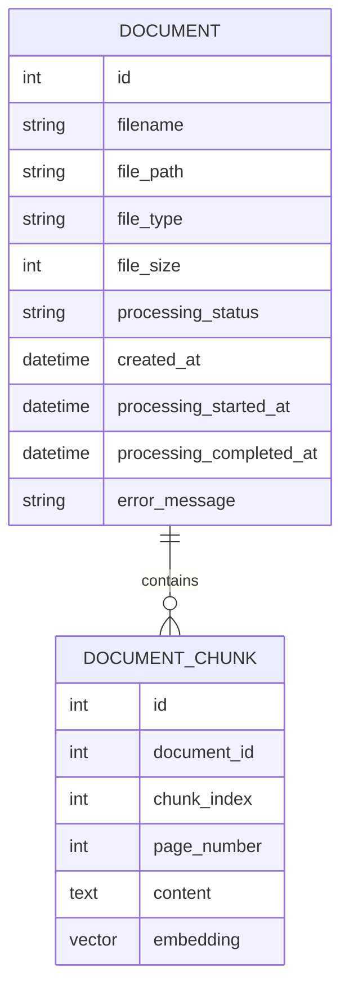

# AI Knowledge Assistant Database Design

## 1. Overview

The AI Knowledge Assistant uses PostgreSQL as the primary relational database.

The database stores:

- Uploaded document metadata
- Document processing states
- Extracted document chunks
- Vector embeddings used for semantic search

The database is designed to support Retrieval-Augmented Generation (RAG) workflows by combining structured document information with vector similarity search.

---

# 2. Database Technology

## Database

- PostgreSQL

## Vector Extension

- pgvector

## ORM

- SQLAlchemy

The application uses SQLAlchemy models to define database tables and relationships.

Database migrations are managed using Alembic.

---

# 3. Entity Relationship Overview



The database follows a one-to-many relationship:

```
Document
    |
    |
    +---- DocumentChunk
    +---- DocumentChunk
    +---- DocumentChunk
```

A single document can contain multiple processed chunks.

---

# 4. Document Table

The `documents` table stores metadata about uploaded files.

## Purpose

The table tracks:

- Original uploaded file information
- Storage location
- Processing lifecycle
- Processing errors

---

## Columns

| Column | Type | Description |
|---|---|---|
| id | Integer | Primary key |
| filename | String | Original uploaded filename |
| file_path | String | Location in storage provider |
| file_type | String | MIME type of uploaded file |
| file_size | Integer | File size in bytes |
| processing_status | String | Current processing state |
| created_at | DateTime | Upload timestamp |
| processing_started_at | DateTime | Processing start timestamp |
| processing_completed_at | DateTime | Processing completion timestamp |
| error_message | Text | Error details when processing fails |

---

# 5. Document Processing Status

Documents move through different processing states.

## Successful Flow

```text
UPLOADED
    |
    v
PROCESSING
    |
    v
COMPLETED
```

## Failed Flow

```text
UPLOADED
    |
    v
PROCESSING
    |
    v
FAILED
```

The status allows the application to track background processing progress.

---

# 6. Document Chunk Table

The `document_chunks` table stores processed sections of documents.

During document processing:

1. PDF text is extracted.
2. Text is divided into smaller chunks.
3. Each chunk receives an embedding vector.
4. Chunks are stored for retrieval.

---

## Columns

| Column | Type | Description |
|---|---|---|
| id | Integer | Primary key |
| document_id | Integer | Foreign key to documents table |
| chunk_index | Integer | Position of chunk within document |
| page_number | Integer | Original PDF page number |
| content | Text | Extracted chunk text |
| embedding | Vector | Semantic embedding representation |

---

# 7. Vector Embeddings

The system uses vector embeddings to enable semantic search.

Each document chunk receives an embedding generated using:

```text
Sentence Transformers
all-MiniLM-L6-v2
```

The embedding converts text into a numerical vector representation.

Example:

```text
Document text

        |
        v

Embedding Model

        |
        v

[0.023, -0.114, 0.532, ...]
```

These vectors are stored using PostgreSQL pgvector.

---

# 8. Similarity Search

When a user asks a question:

1. The question is converted into an embedding.
2. The database compares the question vector against stored chunk vectors.
3. The closest chunks are returned.

The system uses cosine distance.

```text
Lower distance
        |
        v
More similar content
```

```text
Higher distance
        |
        v
Less relevant content
```

Retrieved chunks are then passed to the LLM for answer generation.

---

# 9. Database Access Layer

Database operations are separated from API logic.

Responsibilities include:

- Creating database sessions
- Querying documents
- Retrieving document chunks
- Managing persistence

The application uses:

```text
Router
   |
Service Layer
   |
SQLAlchemy Models
   |
PostgreSQL Database
```

---

# 10. Migrations

Database schema changes are managed using Alembic.

Migration workflow:

```text
Modify SQLAlchemy Model

        |

Create Migration

        |

Apply Migration

        |

Database Schema Updated
```

Example:

```bash
alembic revision --autogenerate
alembic upgrade head
```

---

# 11. Design Considerations

## Separation of Metadata and Content

Document metadata and processed chunks are stored separately.

Benefits:

- Easier document management
- Efficient retrieval
- Better scalability

---

## Vector Search Support

Using pgvector allows the application to perform semantic search directly inside PostgreSQL.

Benefits:

- Reduced infrastructure complexity
- Single database system
- Easy integration with relational data

---

## Future Improvements

Possible database improvements:

- User and authentication tables
- Document ownership
- Access permissions
- Improved indexing strategies
- Dedicated vector database for large-scale deployments

---