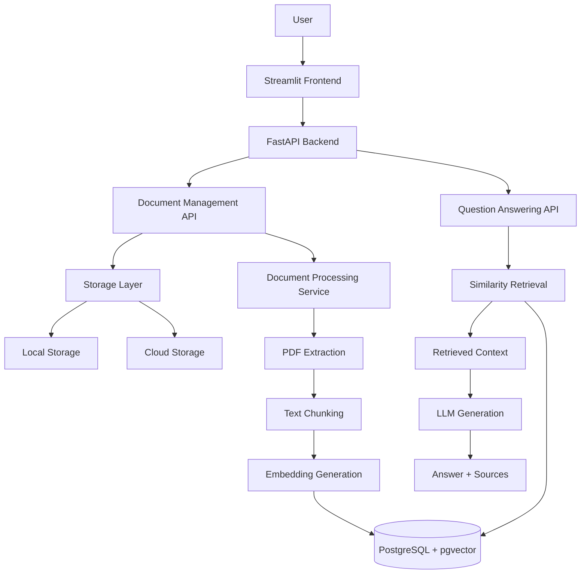
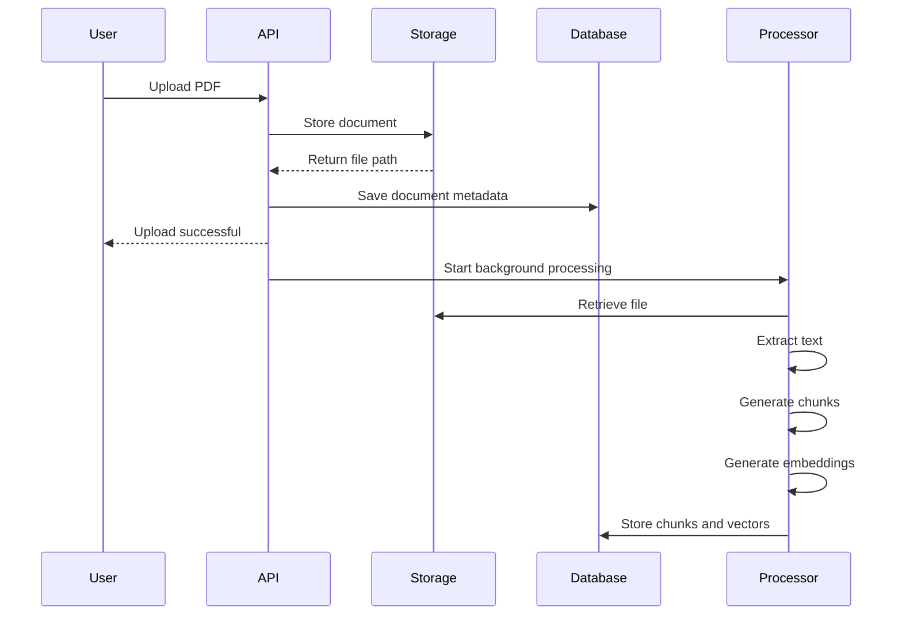
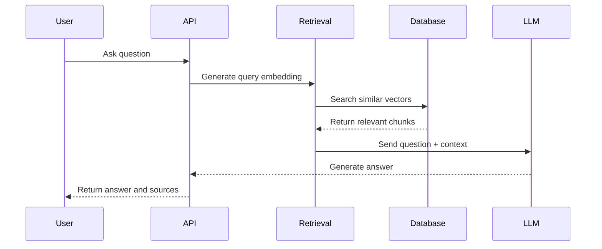

# AI Knowledge Assistant System Design

## 1. Overview

The AI Knowledge Assistant is an AI-powered document question-answering system built using Retrieval-Augmented Generation (RAG).

The system allows users to upload documents and ask natural language questions. Relevant information is retrieved from the uploaded documents and provided to a Large Language Model (LLM) to generate grounded answers with source references.

The system is designed for internal knowledge management use cases such as:

- Company documentation
- HR policies
- Technical manuals
- Internal guidelines
- Onboarding documents

---

# 2. Problem Statement

Organizations often store large amounts of information across documents, making it difficult for users to quickly find relevant answers.

Traditional keyword search has limitations because it requires exact word matches.

The goal of this system is to provide:

- Natural language search
- Context-aware answers
- Reduced information retrieval time
- Reliable responses based on company documents

---

# 3. Functional Requirements

## Document Management

The system should allow users to:

- Upload PDF documents
- Store documents securely
- Retrieve uploaded documents
- Delete documents
- View document processing status

---

## Document Processing

The system should:

- Extract text from uploaded documents
- Split text into smaller chunks
- Generate embeddings
- Store processed chunks

---

## Question Answering

The system should:

- Accept natural language questions
- Retrieve relevant document sections
- Generate answers using retrieved context
- Return source information

---

# 4. Non-Functional Requirements

## Reliability

The system should:

- Handle processing failures gracefully
- Track document processing states
- Provide meaningful error responses

---

## Scalability

The architecture should support:

- Increasing document volume
- More users
- Larger retrieval workloads

---

## Maintainability

The system should:

- Separate responsibilities
- Use modular components
- Allow future technology changes

---

## Security

The system should support future implementation of:

- Authentication
- Authorization
- Document access control
- Secure secret management

---

# 5. High-Level Architecture



---

# 6. System Workflow

## 6.1 Document Upload Flow



---

## 6.2 Question Answering Flow



---

# 7. Component Design

## 7.1 API Layer

Responsible for:

- Handling HTTP requests
- Request validation
- Returning API responses

Technology:

- FastAPI

---

## 7.2 Service Layer

Contains business logic.

Services include:

### Document Processing Service

Responsible for:

- PDF extraction
- Chunk creation
- Embedding generation
- Processing status updates


### Retrieval Service

Responsible for:

- Creating question embeddings
- Similarity search
- Filtering weak matches


### RAG Service

Responsible for:

- Building prompts
- Calling the LLM
- Formatting responses

---

## 7.3 Storage Layer

Provides a unified interface for file operations.

Supported providers:

- Local storage
- Google Cloud Storage

The abstraction allows storage providers to change without affecting application logic.

---

# 8. Data Flow

The complete data lifecycle:

```text
PDF Upload

    |

Storage

    |

Document Record Created

    |

Background Processing

    |

Text Extraction

    |

Chunking

    |

Embedding Generation

    |

Vector Storage

    |

User Question

    |

Similarity Retrieval

    |

LLM Generation

    |

Answer + Sources
```

---

# 9. Scaling Considerations

## Document Processing

Current:

```text
FastAPI Background Tasks
```

For larger workloads:

```text
API

 |

Message Queue

 |

Worker Services

 |

Document Processing
```

Possible technologies:

- Celery
- Redis Queue
- Cloud Tasks

---

## Database Scaling

Current:

```text
PostgreSQL + pgvector
```

Future improvements:

- Database indexing optimization
- Read replicas
- Dedicated vector database

---

## Storage Scaling

Current:

```text
Local Storage
```

Production:

```text
Cloud Object Storage

Examples:

- Google Cloud Storage
- Amazon S3
- Azure Blob Storage
```

---

# 10. Potential Bottlenecks

## Large Document Processing

Problem:

Large PDFs may require significant processing time.

Solution:

- Asynchronous workers
- Processing queues
- Progress tracking

---

## Retrieval Quality

Problem:

Poor embeddings or chunking can reduce answer quality.

Solution:

- Better chunk strategies
- Improved embedding models
- Retrieval evaluation metrics

---

## LLM Latency

Problem:

LLM generation can increase response time.

Solution:

- Streaming responses
- Model optimization
- Response caching

---

# 11. Monitoring and Observability

Future production systems should monitor:

## Application Metrics

Examples:

- Request latency
- Error rates
- Processing duration

---

## AI Metrics

Examples:

- Retrieval accuracy
- Answer quality
- Hallucination rate

---

## Infrastructure Metrics

Examples:

- CPU usage
- Memory usage
- Database performance

---

# 12. Future Improvements

Possible extensions:

- User authentication
- Multi-tenant document management
- Role-based access control
- Conversation history
- Multiple document formats
- Automated RAG evaluation
- Production monitoring dashboards
- Cloud deployment

---

# 13. Final Architecture Summary

The system combines:

```text
FastAPI
+
PostgreSQL + pgvector
+
Sentence Transformers
+
LLM Generation
+
Streamlit Interface
```

to provide a scalable AI-powered document assistant.

The architecture prioritizes:

- Modularity
- Reliability
- Grounded AI responses
- Future scalability